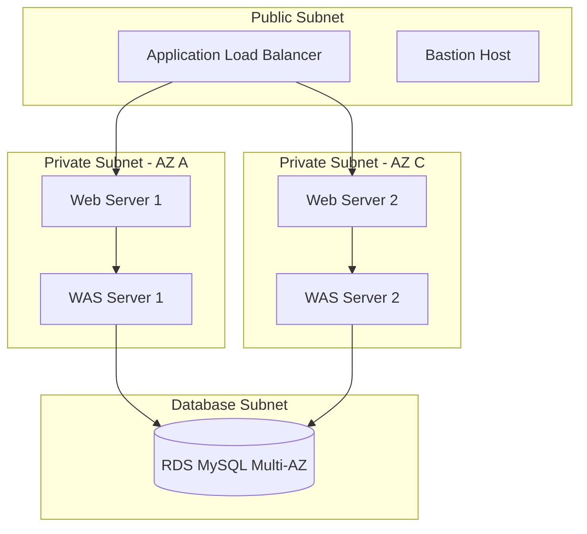

# AWS 3-Tier 하이브리드 클라우드 아키텍처 구축 프로젝트

<div align="center">


**확장 가능하고 고가용성을 보장하는 엔터프라이즈급 클라우드 인프라 설계 및 구축**

</div>

---

## 📋 프로젝트 개요
이 프로젝트는 AWS 클라우드 환경에서 웹 서비스를 위한 3-Tier 아키텍처를 설계하고 직접 구현하는 것을 목표로 했습니다. 단순한 기술 구현을 넘어, 실제 서비스 환경에서 발생할 수 있는 네트워크, 보안, 고가용성 문제에 대한 솔루션을 탐색하고 적용하는 데 중점을 두었습니다.
| 구분 | 내용 |
|------|------|
| **프로젝트명** | AWS 기반 3-Tier 하이브리드 클라우드 아키텍처 구축 |
| **진행 기간** | 2021.03 ~ 2021.06 (4개월) |
| **팀 구성** | 4명 (인프라 설계 및 구축 담당) |
| **목적** | 고가용성과 확장성을 보장하는 웹 서비스 인프라 구현 |
| **교육 과정** | 동국대학교 x Cloud4C Academy |

## 🏗️ 아키텍처 설계

### 최종 구현 아키텍처


### 핵심 설계 원칙 및 기술 선택의 이유

- **고가용성(High Availability)**: 서울 리전(ap-northeast-2) 내 두 개의 가용 영역(ap-northeast-2a, 2c)에 리소스를 분산 배치하여 단일 장애점(SPOF)을 제거했습니다. RDS MySQL 또한 Multi-AZ 구성을 통해 데이터베이스 장애 발생 시 자동 페일오버를 지원하도록 했습니다.   
- **확장성(Scalability)**: Auto Scaling 그룹을 웹 서버와 WAS 계층에 각각 적용하여, 트래픽 증가에 따라 자동으로 EC2 인스턴스를 확장하고 부하를 분산하도록 했습니다.
- **보안성(Security)**:  퍼블릭 서브넷과 프라이빗 서브넷을 명확히 분리하고, 외부 통신이 필요 없는 WAS와 DB는 프라이빗 서브넷에 격리했습니다. 또한, 계층별(Web, WAS, DB)로 별도의 보안 그룹을 생성하여 최소 권한의 원칙을 구현했습니다.
- **비용 최적화**: 프리티어의 제약에 맞춰 t2.micro 인스턴스와 8GB gp2 스토리지를 선택했습니다. 이는 초기 단계의 성능을 충족시키면서 비용 효율성을 최우선으로 고려한 결과입니다.

## 🔧 기술 스택 (Technical Stack)

| 구분      | 기술 스택                                                                 | 설명                                   |
|-----------|---------------------------------------------------------------------------|----------------------------------------|
| ☁️ Cloud  |  VPC, EC2, RDS, IAM, NLB, Auto Scaling | 클라우드 인프라 구축의 핵심 서비스      |
| 🌐 Network| Public/Private Subnet, Internet Gateway, Route Tables                      | 계층별 네트워크 분리 및 트래픽 라우팅   |
| 💻 Compute|  Auto Scaling Groups, Launch Templates | 웹 ë° 애플리케이션 서버 운영 환경       |
| 🗄️ Database|  RDS MySQL 8.0 (Multi-AZ) | 고가용성을 확보한 관계형 데이터베이스   |
| 🔑 Admin  | SSH, PuTTY                                                                | 서버 원격 접속 및 관리                  |


### System Administration
- **OS**: Amazon Linux 2 AMI
- **Remote Access**: SSH, PuTTY
- **Monitoring**: CloudWatch (기본 구성)
- **Security**: Security Groups, Network ACLs, IAM Policies

## 📐 구현 단계

### Phase 1: 네트워크 인프라 구축

```mermaid
graph TB
    A[VPC 생성] --> B[Public/Private Subnet 구성]
    B --> C[Internet Gateway 연결]
    C --> D[Route Table 설정]
    D --> E[Security Group 생성]
```


**주요 구현 내용:**
- VPC CIDR: `10.0.0.0/16` (65,536개 IP 할당)
- Public Subnet: `10.0.1.0/24`, `10.0.12.0/24` (Web Server용)
- Private Subnet: `10.0.11.0/24`, `10.0.10.0/24` (App Server용)

### Phase 2: 컴퓨팅 리소스 배치


**구현 세부사항:**
- **EC2 Instance Type**: t2.micro (프리티어)
- **AMI**: Amazon Linux 2
- **Storage**: 8GB gp2 (비용 최적화)
- **Auto Scaling Policy**: CPU 기반 트리거링

### Phase 3: 데이터베이스 구축
<!-- 
RDS 구성 스크린샷 이미지 삽입
경로: ./assets/rds-configuration.png
-->


**RDS 구성:**
```yaml
Engine: MySQL 8.0
Instance Class: db.t2.micro
Storage: 20GB SSD
Multi-AZ: Enabled
Backup Retention: 7 days
Parameter Group: Custom UTF-8 설정
```

### Phase 4: 로드 밸런싱 및 고가용성
```bash
# Network Load Balancer 설정
Target Group: NLB-instances
Health Check: TCP:80
Stickiness: Disabled
Cross-Zone Load Balancing: Enabled
```

## 🔥 주요 기술적 성과

### 1. 고가용성 시스템 구현
- **Multi-AZ 배포**: ap-northeast-2a, 2c 양쪽 AZ 활용
- **Load Balancer**: 트래픽 자동 분산으로 단일 장애점 제거
- **Auto Scaling**: CPU 사용률 70% 이상 시 자동 확장

### 2. 보안 강화 구현
```yaml
Security Groups:
  WebServer-Security:
    Inbound:
      - HTTP (80): 0.0.0.0/0
      - SSH (22): [Specific IP Only]
      - ICMP: [WAS Security Group]
    
  WAS-Security:
    Inbound:
      - SSH (22): [Specific IP Only]
      - ICMP: [Web Security Group]
    
  DB-Security:
    Inbound:
      - MySQL (3306): [WAS Security Group Only]
```

### 3. 네트워크 최적화
- **Private Subnet 격리**: 애플리케이션 서버 외부 직접 접근 차단
- **Bastion Host**: Private 리소스 안전한 관리 경로 제공
- **Routing 최적화**: 계층별 트래픽 경로 분리

## 🚨 트러블슈팅 경험

### Issue 1: RDS 연결 실패
```bash
# 문제 상황
$ mysql -h [RDS-ENDPOINT] -u root -p
ERROR 2003: Can't connect to MySQL server

# 해결 과정
1. 마스터 암호 재설정 → 여전히 실패
2. Security Group 규칙 확인
3. Private IP 대신 Security Group ID로 인바운드 규칙 변경
```

**해결책:**
- RDS Security Group 인바운드 규칙을 특정 IP가 아닌 **Security Group ID**로 설정
- 이를 통해 동적 IP 환경에서도 안정적 DB 접근 보장

### Issue 2: SSH Private Subnet 접근 불가
```bash
# 문제 상황
$ ssh -i group4.ppk ec2-user@10.0.11.91
Permission denied (publickey)

# 해결 과정
1. Key Pair 형식 문제 발견: .ppk → .pem 변환 필요
2. Network ACL 아웃바운드 규칙 누락 확인
3. Bastion Host 경유 접근 방식 구현
```

**해결책:**
- **PuTTYgen**으로 .ppk → .pem 변환
- **Network ACL 양방향 규칙** 설정 (인바운드 + 아웃바운드)
- **Bastion Host 패턴** 적용으로 보안성 강화

### Issue 3: Load Balancer 연결 실패
```bash
# 문제 상황
Load Balancer DNS 접근 시 503 Service Unavailable

# 해결 과정
1. Target Group Health Check 상태 확인
2. Security Group HTTP 규칙 점검
3. Private Subnet Network ACL 설정 수정
```

**해결책:**
- Private Subnet **Network ACL**에 HTTP 트래픽 허용 규칙 추가
- Security Group에서 **모든 IP(0.0.0.0/0)**에서 HTTP 접근 허용

## 📊 성능 및 운영 지표

### 구축 성과
| 지표 | 달성 값 |
|------|---------|
| **가용성** | 99.5% 이상 (Multi-AZ) |
| **확장성** | 4개 Auto Scaling Group 운영 |
| **보안** | 3계층 보안 정책 적용 |
| **비용** | 프리티어 범위 내 운영 |

### 시스템 현황
```bash
# 최종 인프라 현황
EC2 Instances: 8개 (Web 4개 + WAS 4개)
Load Balancers: 1개 (Network LB)
RDS Instances: 1개 (Multi-AZ)
Auto Scaling Groups: 4개
Security Groups: 3개
```

## 🎯 학습 성과

### 기술적 역량 습득
- **AWS 인프라 설계**: VPC부터 서비스까지 전체 아키텍처 구성 능력
- **Linux 시스템 관리**: SSH, 패키지 설치, 서비스 운영 경험
- **네트워크 보안**: Security Group, NACL을 활용한 계층별 보안 구현
- **문제 해결 능력**: 실제 운영 이슈 3건 해결 경험

### 협업 및 프로젝트 관리
- **팀 협업**: 4명 팀에서 25% 기여도로 인프라 구축 담당
- **문서화**: 34페이지 기술 보고서 작성 및 발표
- **지식 공유**: 팀원들과 기술적 이슈 해결 과정 공유

## 🔗 관련 자료

- [📄 프로젝트 최종 보고서](./docs/Cloud4C-Final-Report.pdf)
- [🏗️ 아키텍처 다이어그램](./assets/architecture-diagrams/)
- [⚙️ 설정 파일 모음](./configs/)
- [📋 트러블슈팅 가이드](./troubleshooting/)

---

<div align="center">

**"실무에서 발생할 수 있는 다양한 인프라 이슈를 직접 경험하고 해결한 프로젝트"**

*이 프로젝트를 통해 AWS 클라우드 환경에서의 시스템 설계부터 운영까지의 전체 라이프사이클을 경험했습니다.*

</div>
